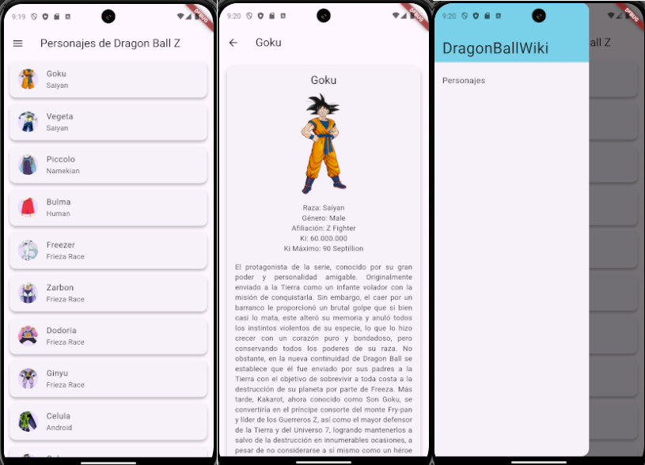

# DragonBallWiki

DragonBallWiki es una aplicación que permite buscar información relacionada a los diferentes personajes dentro del universo de Dragon Ball detallando cada característica de estos, como lo son su poder de Ki, su planeta de origen, la cantidad de transformaciones que tiene, una descripción, también una imagen como referencia.

También permite generar simulaciones de combate entre personajes seleccionados.\
Diagrama de clases de la aplicacion.

Estructura de la capeta lib:\
/lib\
├── main.dart\
├── models/\
│   ├── character_model.dart\
│   ├── planet_model.dart\
│   ├── transformation_model.dart\
│   └── battle_result_model.dart\
│   └── user.dart\
├── services/\
│   ├── api_service.dart\
│   └── battle_logic.dart\
│   └── database_helper.dart\
├── pages/\
│   ├── home_screen.dart\
│   ├── character_list_screen.dart\
│   ├── character_detail_screen.dart\
│   ├── duel_screen.dart\
│   ├── tournament_screen.dart\
│   ├── preferences_screen.dart\
│   ├── profile_screen.dart\
├── widgets/\
│   ├── character_card.dart\
│   ├── planet_card.dart\
│   └── transformation_card.dart\
│   └── mydawer.dart\
├── providers/\
│   ├── favorites_provider.dart\
│   ├── preferences_provider.dart\
│   └── database_helper.dart\

## Evidencias aplicación

