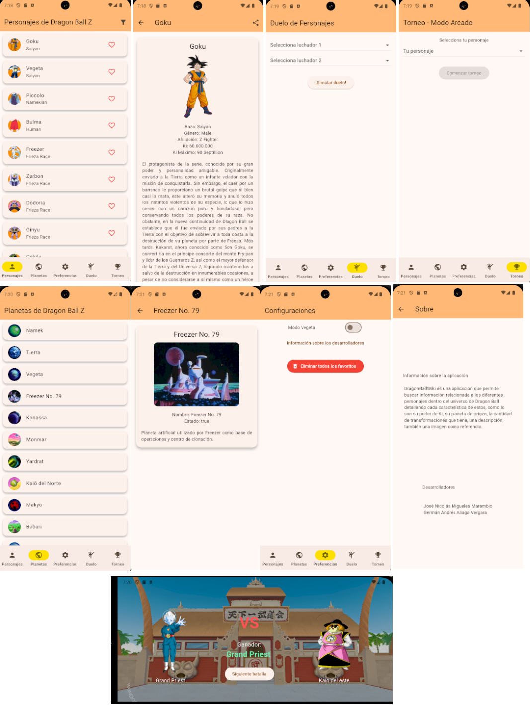

# DragonBallWiki

DragonBallWiki es una aplicación que permite buscar información relacionada a los diferentes personajes dentro del universo de Dragon Ball detallando cada característica de estos, como lo son su poder de Ki, su planeta de origen, la cantidad de transformaciones que tiene, una descripción, también una imagen como referencia.

También permite generar simulaciones de combate entre personajes seleccionados.\
Diagrama de clases de la aplicacion.

Estructura de la capeta lib:\

/lib\
├── main.dart\
├── models/\
│   ├── battle_result_model.dart\
│   ├── character_model.dart\
│   ├── planet_model.dart\
│   └── transformation_model.dart\
├── services/\
│   └── api_service.dart\
├── pages/\
│   ├── about.dart\
│   ├── battle_result_screen.dart\
│   ├── character_detail_screen.dart\
│   ├── character_list_screen.dart\
│   ├── duel_screen.dart\
│   ├── planet_detail_screen.dart\
│   ├── planet_list_screen.dart\
│   ├── preferences_screen.dart\
│   ├── profile_screen.dart\
│   ├── splash_screen.dart\
│   └── tournament_screen.dart\
├── widgets/\
│   ├── character_card.dart\
│   ├── planet_card.dart\
│   └── myfooter.dart\
├── providers/\
│   ├── favorites_provider.dart\
│   └── preferences_provider.dart\
└── theme/\
    ├── color_scheme.dart\
    └── themes.dart\

## Evidencias aplicación

## Lista de actividades por hacer
-Mostrar los planetas\
-Mostrar las transformaciones\
-Hacer la lógica de las peleas\
-Hacer un sistema de torneos \
-Implementar filtros de búsqueda\ 
-Modificar orientación de la pantalla para los combates \
-Hacer tabs para la navegación entre pantallas.\
-Implementar Tema\
-Mejorar el aspecto visual\

## Link video

https://youtu.be/qtRXV6I4dkw

